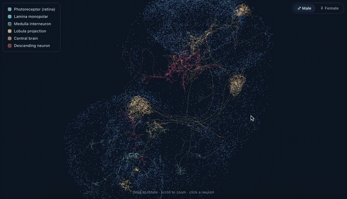

# From Sight to Action

**An interactive explorer of the *Drosophila* visual–motor connectome.**


[](https://sight-to-action.netlify.app)

<sub>▲ Real EM-traced neuron morphology from the MaleCNS connectome. **[Click to open the live site](https://sight-to-action.netlify.app)**, or [watch the full-quality recording](https://sight-to-action.netlify.app/media/demo-full.mov).</sub>

How can visual information travel through the fruit-fly nervous system towards
neurons involved in movement control? This project traces one structural
pathway — from the **R1–R6 photoreceptors** to **DNg13**, a descending neuron
of the locomotor control population — through the open
[MaleCNS connectome](https://male-cns.janelia.org/download/), and presents it
as interactive 3D neuron reconstructions, a weighted connectivity graph and
evidence-linked information about every neuron.

> Everything shown is a **structural** account of wiring: which neurons
> connect to which, and how strongly. It does not simulate neural firing and
> does not predict behaviour.

---

## What's in the app


| View | What it does |
| --- | --- |
| **3D connectome** | Real EM-traced neuron skeletons, coloured by pathway stage, inside a soma point-cloud of the whole CNS. Click a neuron to inspect it. |
| **Journey** | A step-by-step animated walk from retina → lamina → medulla → lobula → central brain → descending neuron, with the 3D view following along. |
| **Circuit** | A simplified weighted graph of the pathway; arrow thickness is the fraction of the target's input supplied by that source. |
| **Routes** | Ranked alternative routes, path lengths, bottleneck neurons, and a node-removal experiment showing how structural routes change. |
| **Explore** | Pick any of 30 senses (filterable by modality) and any of 480 movement neurons and get the real route, its strength and how it ranks — draw it in the 3D view, play it neuron by neuron, and see which senses share a gateway into that neuron. |
| **Context** | Whether the route is stronger than chance: rank against all descending neurons, against all sensory modalities, against weight-shuffled graphs, plus a threshold-robustness sweep. |
| **Sex** | The whole analysis re-run on the *female* FlyWire connectome, with the female brain viewable in 3D: which connections have a female counterpart, how their strengths compare, which routes are conserved, and the null test replicated in the female brain. |
| **Neuron detail** | Cell type, class, connection strengths, predicted neurotransmitter, sex status, and an evidence label on every claim, with links to neuPrint. |

## Headline finding

Existing connectome explorers will return a path between almost any two
neurons, because a dense recurrent network links nearly everything within a
few hops. **So "a path exists" is weak evidence — and this project measures
how weak.**

The R1–R6 → DNg13 route is real, reproducible and stable across thresholds.
It also turns out **not to be statistically special**:

- DNg13 ranks **312 of 480** descending neurons for connection strength from
  the photoreceptors.
- R1–R6 ranks **191 of 333** sensory types into DNg13 — whose strongest
  structural sensory inputs are mechanosensory, gustatory and olfactory, not
  visual.
- **70% of weight-shuffled** versions of the same graph produce a route at
  least as strong.

The same ranking independently surfaces **DNp01 (the Giant Fiber)** and the
other known visually-driven descending neurons at the top — about 140×
stronger than DNg13 — which is a useful check that the method works.

The pathway also proves not to be sex-neutral, and this is *computed* rather
than read off annotations. Re-running the identical analysis on the female
FlyWire connectome: **25 of 31** connections have a female counterpart, and all
6 that don't involve only LoVP92 and VES200m — exactly the two male-specific
neurons. The
strongest male route (via the male-specific **LoVP92**) does not exist in the
female brain, which reaches DNg13 another way. The null result replicates too —
DNg13 ranks 264/443 female descending neurons, below median as in the male.

Full write-up: [docs/methods-and-findings.md](docs/methods-and-findings.md).

## Run it

The deployed site is at **<https://sight-to-action.netlify.app>**. To run it
locally:

```bash
npm install --prefix web
npm run dev --prefix web
```

Then open <http://localhost:5173>. The app reads pre-computed JSON files, so
it needs no backend.

## Reproduce the analysis

```bash
python3 -m venv .venv && source .venv/bin/activate
pip install -r requirements.txt
```

Download the connectome tables (~560 MB, public, no API token):

```bash
BASE=https://storage.googleapis.com/flyem-male-cns/v1.0/connectome-data/flat-connectome
curl -o data/raw/body-annotations-male-cns-v1.0-minconf-0.5.feather $BASE/body-annotations-male-cns-v1.0-minconf-0.5.feather
curl -o data/raw/body-neurotransmitters-male-cns-v1.0.feather $BASE/body-neurotransmitters-male-cns-v1.0.feather
curl -o data/raw/connectome-weights-male-cns-v1.0-minconf-0.5-significant-only.feather $BASE/connectome-weights-male-cns-v1.0-minconf-0.5-significant-only.feather
```

Optionally add the **female** connectome for the sex comparison (~880 MB):

```bash
mkdir -p data/raw/flywire
curl -L -o data/raw/flywire/proofread_connections_783.feather \
  "https://zenodo.org/records/10676866/files/proofread_connections_783.feather?download=1"
curl -L -o data/raw/flywire/flywire_annotations.tsv \
  "https://raw.githubusercontent.com/flyconnectome/flywire_annotations/main/supplemental_files/Supplemental_file1_neuron_annotations.tsv"
```

The build skips the female comparison if these are absent.

Then run the notebook, which regenerates every file the app consumes
(skeletons are fetched from the public bucket on first run and cached):

```bash
jupyter nbconvert --to notebook --execute --inplace notebooks/01_extract_pathway.ipynb
```

The app copies `data/processed/*.json` into place automatically whenever you
run `npm run dev` or `npm run build`, so there is no manual sync step.

## Deploying

The site is a static build with no backend. On Netlify the settings come from
[netlify.toml](netlify.toml) — base directory `web`, build `npm run build`,
publish `web/dist`. The analysis outputs are committed under `data/processed/`
and copied into the bundle at build time, so a deploy needs no extra steps.

## Tests

```bash
python -m pytest tests/ -m "not needs_data"      # fast, no data download needed
python -m pytest tests/                          # includes checks against the real connectome
```

The suite pins down what the route ranking actually computes (relative weights
sum to one per target, score is their product along a path, hop limits hold),
and cross-checks the fast route finder used by the Explore tab against the
exact k-shortest-paths implementation used everywhere else. That equivalence
had previously only been verified by hand — and when it was made automatic it
immediately caught a real bug, described in the commit history.

## Repository layout

```
src/sight_to_action/
  data.py        loaders for the MaleCNS flat tables
  analysis.py    type-level graph, route ranking, bottlenecks, removal experiment
  nulls.py       null models: rank vs other DNs/senses, weight-shuffled graphs
  explorer.py    precomputes every sense -> every descending neuron for the app
  female.py      rebuilds the same graph on FlyWire and compares male vs female
  pipeline.py    assembles the pathway dataset (evidence + sex labels)
  skeletons.py   SWC download, parsing and decimation
  build.py       one reproducible build of every artefact
notebooks/       the analysis, executed with outputs
tests/           pytest suite; synthetic fixtures, no data download required
web/             React + Three.js (R3F) + Cytoscape.js application
docs/            methods and findings write-up
data/processed/  small derived JSON consumed by the app (committed)
data/raw/        downloaded connectome tables and skeletons (gitignored)
```

## Method in one paragraph

Body-to-body connectivity is collapsed to a type-level directed graph. Each
edge carries the total synapse count **and** a relative weight — the fraction
of the target type's input coming from that source — so that routes are not
dominated by simply large cell types. Routes are ranked by the product of
relative weights along the path (a shortest path under `−log` cost), searched
within a corridor of types that can lie on a ≤5-hop path. Bottlenecks are
types shared by many alternative routes; the removal experiment deletes a
type and re-runs the search.

## Data and licence


**Male:** MaleCNS v1.0, CC-BY, produced by HHMI Janelia, the Cambridge
Drosophila Connectomics Group, Google Research and collaborators —
<https://male-cns.janelia.org/download/>.

**Female:** FlyWire/FAFB whole-brain connectome, snapshot 783, CC-BY —
connectivity from [Zenodo 10676866](https://zenodo.org/records/10676866),
annotations from [flyconnectome/flywire_annotations](https://github.com/flyconnectome/flywire_annotations)
(Schlegel et al., *Nature* 2024; Dorkenwald et al., *Nature* 2024).

## Status

- [x] Validated R1–R6 → DNg13 pathway extracted from real connectivity
- [x] Interactive 3D EM-traced neuron skeletons
- [x] Animated step-by-step journey through the pathway
- [x] Route ranking, path lengths, alternative routes, bottleneck analysis
- [x] Structural node-removal experiment
- [x] Male/female comparison computed on the female FlyWire connectome
- [x] Statistical null models and threshold-robustness analysis
- [x] Interactive explorer over all 30 senses x 480 descending neurons
- [x] Any route drawn and played back in 3D at real soma positions
- [x] Male and female brains both viewable in 3D, with routes drawn in either
- [x] Four-level evidence labelling with links to source data
- [x] Reproducible notebook, documented provenance, methods write-up
- [x] Public deployment
- [x] Short demonstration video

## How this project was built, and my use of AI tools

This is stated plainly because the commit history shows an AI co-author
trailer, and I would rather be direct about it than have someone work it out.

**What I brought.** The choice of project and question; the decision to trace
a specific sensory-to-motor pathway rather than build another connectome
browser; the scope, the endpoints (R1–R6 → DNg13) and the requirement that
every claim be labelled by how well it is evidenced. I directed each round of
work, judged the output, and rejected what was not good enough — the 3D view
went through several rewrites on my feedback, and I found the interaction bugs
(stray neuron selection, stutter on zoom) that led to real fixes.

**What the AI did.** Wrote most of the code, and proposed the analysis
methods — the relative-weight edge definition, the route ranking, the null
models and the cross-connectome comparison were drafted by Claude and then
reviewed and iterated with me. It also carried out the data engineering:
locating the public datasets, the download pipeline, the SWC decimation and
the web application.

**What I checked.** That the endpoints and cell types exist in the data; that
the neurotransmitter predictions match known biology (R1–R6 histaminergic,
L1 glutamatergic) as a sanity check on the pipeline; that the reported
findings follow from the outputs; and that the caveats are stated. The test
suite exists precisely so these claims do not rest on trust — writing it
immediately exposed a bug affecting 17% of routes in the Explore tab.

**What I would not claim.** The science here is a reproduction, not a
discovery. The visual pathway it recovers is textbook, the sexual dimorphism
in this dataset is published, and the tooling category is well served by
neuPrint, Codex and Virtual Fly Brain. What I think is genuinely uncommon is
the combination: a route, a statistical test of whether that route is
remarkable, the same analysis repeated on a second connectome, and an explicit
evidence label on every statement.

## Acknowledgements

Claude Code was used as an AI coding assistant for implementation, debugging and documentation support. The project scope, scientific framing, analysis decisions, validation and final interpretation were directed and reviewed by Kiana Ruiz.

## Licence

Code is MIT (see [LICENSE](LICENSE)). The connectome datasets are the work of
others and remain under their own CC-BY terms, which require attribution to
the original authors — see the licence file for details.
